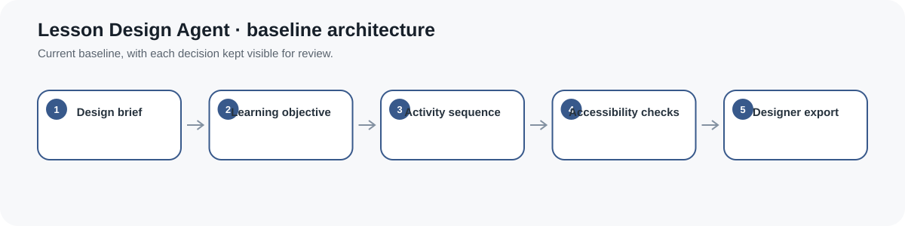
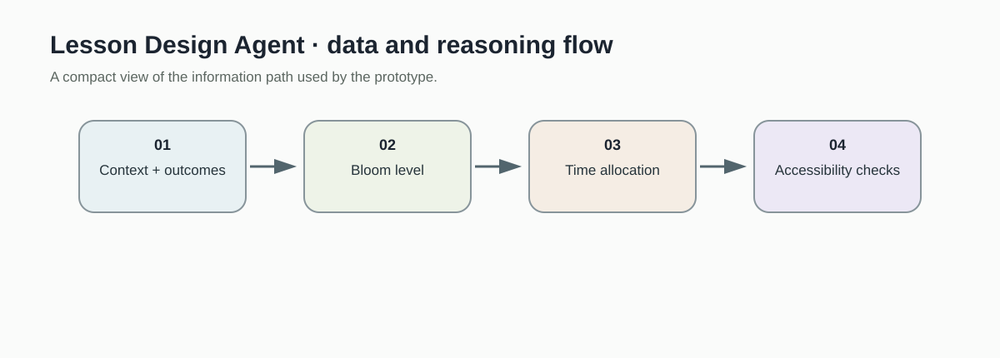
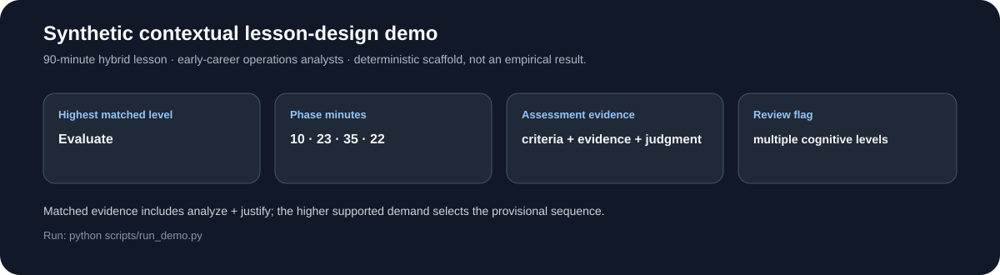
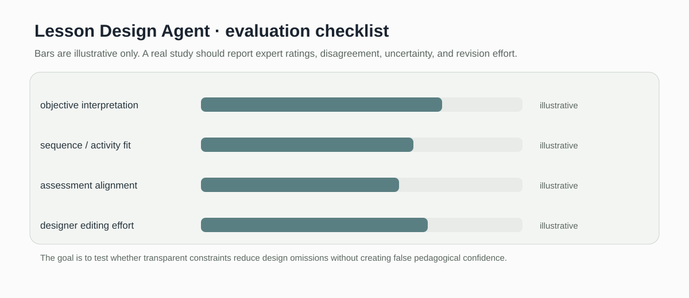

# Lesson Design Agent

> Deterministic lesson planning baseline for Bloom level inference, time allocation, and accessibility checks.

[](https://github.com/devissaputra/lesson-design-agent/actions/workflows/ci.yml)



**Area:** Instructional Design & Curriculum Intelligence    
**Status:** working research prototype  
**Author:** Devis Wawan Saputra

## What this project is for

This project treats lesson planning with AI as a constrained design task rather than a one shot text generation prompt. The current baseline infers a Bloom level from an objective, allocates time across lesson phases, and checks a small set of accessibility requirements. It does not generate a complete lesson or assessment.

**Who may find it useful:** Instructional designers and education researchers exploring human-in-the-loop generative design tools.

## Research questions

1. Can structured design constraints improve consistency of lesson plans generated by AI?
2. How can pedagogical rationale remain visible to the designer?
3. Which accessibility and assessment checks should be mandatory before export?

## How it works

The current tool is a deterministic design baseline, not a generative agent. It infers a Bloom level from explicit verbs, divides the requested duration across four lesson stages without losing minutes, and returns a short accessibility checklist.



The implemented path starts from topic, objective, and duration. Those constraints drive the cognitive level and time allocation before accessibility checks are attached for designer review.



This snapshot shows the bundled synthetic example for Lesson Design Agent. It checks the software path; it is not an empirical performance result.

## Methods in the current baseline

- Bloom verb inference
- four stage lesson sequence
- exact time budget allocation
- guided practice structure
- accessibility checklist

## Data

No learner data required; includes synthetic design briefs.

`data/README.md` documents the sample schema and the conditions that should be recorded before any real dataset is connected. Restricted or identifiable learner data should stay outside the repository.

## Run the demo

```bash
git clone https://github.com/devissaputra/lesson-design-agent.git
cd lesson-design-agent
python scripts/run_demo.py
python -m unittest discover -s tests -v
```

The demo builds a 90 minute risk analysis lesson. The four stage schedule now always sums exactly to the requested duration, including awkward time values.

## What to evaluate next

A stronger version should compare these deterministic drafts with expert designed lessons and with a language model under the same constraints. Alignment, feasibility, accessibility, and designer editing effort should be rated separately.

## Evaluation view



The Lesson Design Agent dashboard is an evaluation checklist rather than a result chart. The bars are illustrative only; the labels show the evidence a real study would need to collect.

## Limits and responsible use

The baseline does not write lesson content, align assessments, or understand subject matter. Its output is a planning scaffold that still requires a qualified learning designer. See `docs/ethics_and_risks.md` for the broader risk review.

## Repository map

```text
.
├── .github/workflows/ci.yml
├── assets/
│   ├── architecture.svg
│   ├── data_flow.svg
│   ├── demo_snapshot.svg
│   └── evaluation_dashboard.svg
├── data/
│   ├── README.md
│   └── sample.csv
├── docs/
│   ├── ethics_and_risks.md
│   ├── related_work.md
│   └── research_protocol.md
├── reports/model_card.md
├── scripts/run_demo.py
├── src/lesson_design_agent/core.py
├── tests/test_core.py
├── CITATION.cff
├── LICENSE
├── pyproject.toml
└── README.md
```

## Research path

A credible next version would:

1. build a small expert reviewed set of objectives and lesson plans
2. measure whether the time and sequence scaffold reduces design omissions
3. compare deterministic and generative drafts under the same review rubric

## Related work

`docs/related_work.md` points to open projects that are relevant to this problem area. They are context for comparison and study design; this repository does not present their code as its own.

## Citation and license

`CITATION.cff` contains the software citation. The code and original SVG visuals use the MIT License. Any external dataset keeps its own license and usage conditions.
