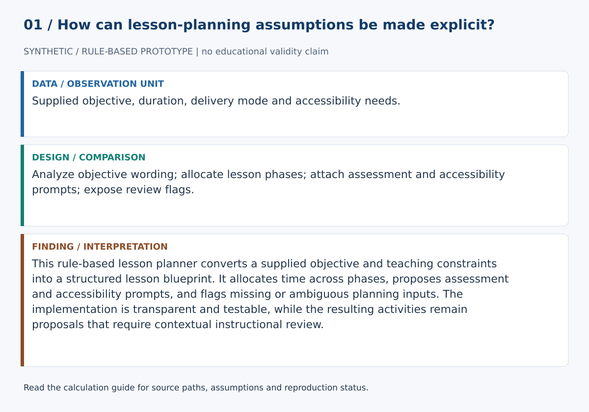
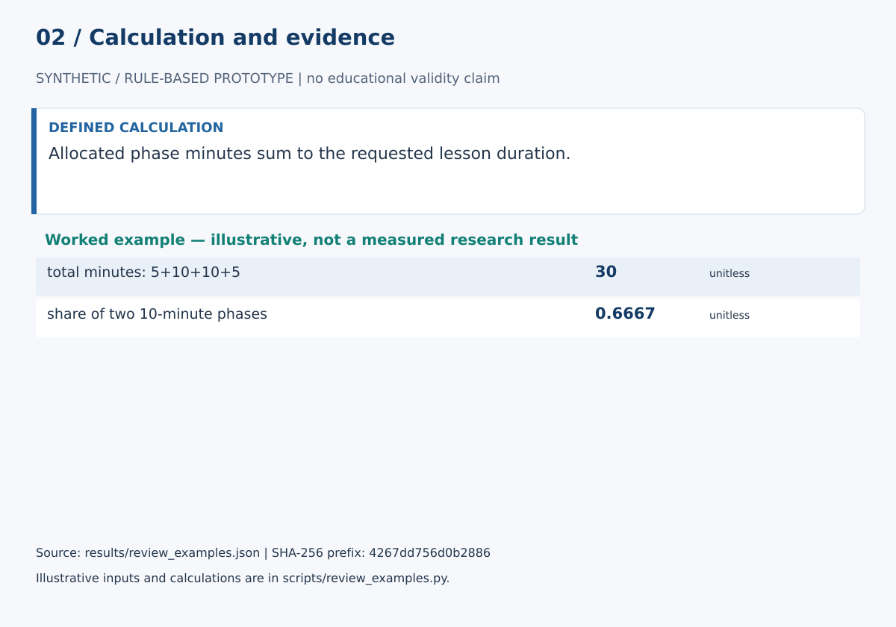

# Lesson Design Agent

This rule-based lesson planner converts a supplied objective and teaching constraints into a structured lesson blueprint. It allocates time across phases, proposes assessment and accessibility prompts, and flags missing or ambiguous planning inputs. The implementation is transparent and testable, while the resulting activities remain proposals that require contextual instructional review.

## Start here

- [Calculations, evidence and verification scope](CALCULATIONS.md)
- [Figure sources and exact numerical paths](docs/figure_spec.json)
- [Data status](data/README.md)





**Review scope:** 28 existing unittest checks passed. The bundled demonstration executed successfully in this review.

## Detailed project documentation

> Transparent lesson-design scaffold for objective analysis, adaptive sequencing, assessment-alignment prompts, accessibility prompts, and human review.

[](https://github.com/devissaputra/lesson_design_agent/actions/workflows/ci.yml)


**Area:** AI in Education (AIEd) · Instructional Design & Curriculum Intelligence  
**Status:** working research prototype  
**Author:** Devis Saputra

## What this project is for

Lesson planning with AI should expose its assumptions rather than hide them behind fluent prose.

This repository implements a deterministic lesson-design baseline that turns an instructional brief into an inspectable planning scaffold. It analyzes explicit objective verbs, adapts the lesson sequence to the provisional cognitive demand, preserves the requested time budget, proposes a form of assessment evidence, generates contextual accessibility prompts, and flags missing design information.

It does **not** call a language model or generate complete lesson content. That makes it useful as a transparent baseline for future comparisons with generative systems.

**Who may find it useful:** instructional designers, learning scientists, L&D practitioners, curriculum teams, and AIEd researchers studying human-in-the-loop lesson design.

## Research questions

1. Can explicit instructional constraints improve the consistency and inspectability of machine-assisted lesson planning?
2. How accurately does a transparent objective-verb baseline identify cognitive demand compared with expert judgment?
3. Does adapting lesson phases to cognitive demand reduce obvious objective/activity mismatches?
4. Do contextual review flags help designers notice missing audience, modality, prerequisite, assessment, or accessibility information?
5. How much editing effort is required before the scaffold becomes an expert-acceptable lesson plan?

## Inputs

The current `lesson_blueprint()` accepts:

- topic
- learning objective
- whole-minute duration
- audience
- delivery mode
- prior knowledge
- class size
- assessment mode
- known accessibility needs

Topic, objective, and duration are required to run the software. Missing context remains visible through review flags.

## How it works


The baseline follows this path:

1. validate the design brief
2. inspect explicit objective verbs
3. retain the matched evidence
4. infer the highest supported cognitive level, or leave it unknown
5. select a cognitive-demand-specific lesson sequence
6. allocate the exact requested duration
7. attach an assessment-evidence prompt
8. attach contextual accessibility prompts
9. surface ambiguity and missing context for designer review

No hidden score determines whether the lesson is “good.”

## Objective analysis

The code uses a transparent Bloom-style verb lexicon covering common actions such as:

- define, identify, recall
- explain, classify, summarize
- apply, calculate, solve
- analyze, compare, contrast
- evaluate, critique, justify
- create, design, construct, revise

Inflected forms are normalized where the deterministic rules support them.

If no supported action verb is found, the system returns:

```text
objective_level = None
review flag = objective_level_unknown
```

It does **not** silently classify the objective as `understand`.

If several cognitive levels are present, the highest matched level selects the provisional sequence and the system adds:

```text
multiple_cognitive_levels_detected
```

The evidence remains visible so a designer can disagree with the inference.

## Adaptive lesson sequences

The four phases change with the provisional cognitive demand.

For example:

| Cognitive demand | Character of the lesson scaffold |
|---|---|
| Remember | activation → concise explanation → retrieval practice → feedback |
| Understand | activation → model meaning → guided sense-making → feedback |
| Apply | prerequisites → worked example → guided application → independent transfer |
| Analyze | criteria → model analysis → guided analysis → independent analysis/critique |
| Evaluate | criteria → model judgment → guided evaluation → defend/revise |
| Create | constraints → exemplars/strategies → iterative construction → critique/revision |

These are inspectable design hypotheses, not universal pedagogical laws.

## Exact time budgeting

Each cognitive level has a provisional phase weighting.

The allocation algorithm:

- accepts whole positive minutes
- preserves the exact requested total
- gives every phase at least one minute when the duration allows it
- surfaces a `duration_review` flag for very short lessons

This makes the scheduling behavior deterministic and testable.

## Assessment alignment prompt

The system now proposes a form of learning evidence matched to the provisional cognitive demand.

An **analyze** objective, for example, calls for evidence that requires learners to separate parts, compare relationships, and justify their analysis rather than simply recall definitions.

This remains a prompt. The software does not establish content validity, fairness, reliability, or appropriate stakes.

## Accessibility prompts

The previous static “accessibility checks” have been replaced by **accessibility prompts**.

The prompts respond to delivery mode and any human-supplied accessibility needs. Digital or hybrid designs, for example, receive prompts about keyboard access, meaningful visual alternatives, and captions/transcripts.

The system does not test files, inspect websites, infer disability, or certify legal/technical compliance.

## Review flags

The current scaffold can surface:

- `objective_level_unknown`
- `multiple_cognitive_levels_detected`
- `duration_review`
- `audience_not_specified`
- `delivery_mode_not_specified`
- `prior_knowledge_not_specified`
- `assessment_mode_not_specified`
- `accessibility_needs_not_specified`

These are designer prompts rather than automatic rejection rules.

## Synthetic demo


The bundled 90-minute example uses:

- operational risk analysis
- early-career operations analysts
- hybrid delivery
- explicit prerequisite knowledge
- case-analysis assessment mode
- two supplied accessibility needs

The objective contains both `analyze` and `justify`, so the baseline preserves both matches and selects the higher supported cognitive demand for the provisional sequence.

The demo is a software example, not an empirical learning result.

## Data

`data/sample.csv` contains four synthetic lesson-design briefs across several cognitive demands.

`data/README.md` documents the schema and explains why audience, modality, prerequisites, assessment evidence, and accessibility context matter.

No learner-level data are required by the current baseline.

## Run the demo

```bash
git clone https://github.com/devissaputra/lesson_design_agent.git
cd lesson_design_agent
python scripts/run_demo.py
python -m unittest discover -s tests -v
```

The current baseline uses only the Python standard library.

## Core API

`objective_analysis(objective)` returns the matched verbs, matched cognitive levels, and highest supported level.

`infer_level(objective)` returns the highest supported level or `None`.

`lesson_blueprint(...)` produces the contextual lesson-design scaffold, including sequence, rationales, assessment prompt, accessibility prompts, review flags, and design status.

## Evaluation view


The evaluation graphic shows evidence a real study should collect. Its bars are illustrative and do not report measured system performance.

## Limits and responsible use

The baseline does not:

- understand subject matter
- generate full lesson content
- verify factual accuracy
- prove objective/activity/assessment alignment
- validate an assessment
- certify accessibility
- model individual learner performance
- optimize timing from empirical outcomes

A learning designer, instructor, and where needed subject-matter/accessibility experts remain responsible for the final design.

See `docs/ethics_and_risks.md` for lesson-design-specific risks.

## Repository map

```text
.
├── .github/workflows/ci.yml
├── assets/
│   ├── architecture.svg
│   ├── data_flow.svg
│   ├── demo_snapshot.svg
│   └── evaluation_dashboard.svg
├── data/
│   ├── README.md
│   └── sample.csv
├── docs/
│   ├── ethics_and_risks.md
│   ├── related_work.md
│   └── research_protocol.md
├── reports/model_card.md
├── scripts/run_demo.py
├── src/lesson_design_agent/core.py
├── tests/test_core.py
├── .gitignore
├── CITATION.cff
├── LICENSE
├── pyproject.toml
└── README.md
```

## Research path

A credible next version would:

1. build an expert-coded objective and lesson-design benchmark
2. measure agreement and disagreement in cognitive-demand interpretation
3. compare deterministic, unconstrained generative, constrained generative, and expert designs
4. measure editing effort and rationale quality
5. evaluate accessibility prompts against expert review
6. add subject-matter-aware retrieval only when sources can be inspected and cited
7. add generative drafting only after the deterministic control condition is stable

## Related work

`docs/related_work.md` places the project in the context of learning-objective design, instructional alignment, Bloom-style cognitive demand, and CAST Universal Design for Learning guidance.

## Citation and license

`CITATION.cff` contains the software citation. Code and original SVG visuals use the MIT License. External course content, standards, and datasets retain their own licenses and usage conditions.
